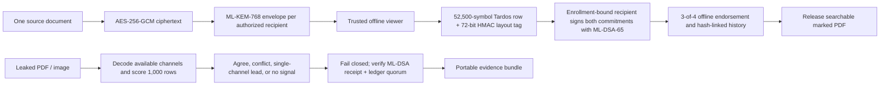

# The decision

**Review update, 10 September evening:** The recommendation below is the original
submission-readiness decision. The [independent goal audit](INDEPENDENT_GOAL_AUDIT_2026-09-10.md)
found no demonstrated state-of-the-art advantage, reproduced and repaired a PDF
corroboration-policy defect, and measured substantially worse Dhruva transfer.
NISHAN is retained as the prepared submission. The user subsequently directed
that NISHAN and Dhruva both receive serious improvement attempts before any
alternative investigation; see [the current focus decision](ORIGINAL_IDEAS_FIRST_2026-09-10.md).
The user confirmed the internal deadline as **15 September**.

Submit **SIH26237, NISHAN-PQ**, for the internal hackathon now. Keep **SIH26168, Dhruva**, as the team's second permitted national submission, but do not make it the primary until its end-to-end navigation benchmark crosses ISRO's stated drift target on a clean holdout.

This recommendation differs from the Claude campaign brief. Claude correctly found the most valuable screening asymmetry in SIH26168: ISRO explicitly requires preliminary models and IO-VNBD position plots in the proposal. It also correctly identified SIH26237 as a late, technically serious and low-count problem. The deciding evidence arrived only after building both directions:

- **NISHAN-PQ now includes a conflict-aware dual-carrier path.** It encrypts once, wraps the key with real ML-KEM-768, assigns a 52,500-symbol Tardos row plus a domain-separated 72-bit HMAC layout tag at decryption, preserves live PDF text, signs both commitments with real ML-DSA-65, and commits the event to the offline quorum. Editable PDFs are attributed only when both channels name the same signed release. Removing either channel leaves an investigative lead but forces abstention; transplanting one recipient's visual carrier onto another's layout produces a conflict and no accusation. Raster leaks use the Tardos path and record the theorem boundary per attack.
- **Dhruva's corrected phone-only result is still above target.** On a contiguous held-out portion of IO-VNBD S1, 51 non-overlapping 60-second outages produce **71.8 m median endpoint error and 18.3% median drift**, while ISRO asks for less than 10%. A speed-only diagnostic with reference heading reaches 13.2%, but that is an ablation and must not be presented as full navigation.
- **A proposal can improve after the internal selection; credibility cannot be repaired after an exaggerated result.** NISHAN gives an internal jury a complete, understandable live proof today. Dhruva gives the team a high-upside second national entry if the map-constrained estimator reaches its quantitative gate.

No project can guarantee selection. In SIH 2025, 72,165 ideas were submitted and 1,360 teams reached the grand finale, a raw rate of about **1.88%**. The same government release reports 271 problem statements. The 2026 rules say only four to five teams may be selected per statement, and the creating organization may choose none if proposals do not meet its expectations. Those facts make problem choice, evidence quality and PS compliance more valuable than a fashionable theme. [PIB's SIH 2025 participation release](https://www.pib.gov.in/PressReleasePage.aspx?PRID=2201244&lang=1&reg=3) [SIH 2026 official guidelines](https://www.sih.gov.in/letters/SIH2026-Guidelines-College-SPOC.pdf)

## Submit these portal fields

| Field | Value |
|---|---|
| Problem Statement ID | **SIH26237** |
| Organization | **Ministry of Defence — Indian Navy (WESEE)** |
| Category / theme | **Software · Blockchain & Cybersecurity** |
| Idea title | **NISHAN-PQ — Every decrypted copy leaves a verifiable mark** |
| Short description | Use the 95-word copy in [`paste_ready_submission.md`](../submissions/SIH26237_NISHAN_PQ/paste_ready_submission.md) |
| Presentation | Use [`NISHAN-PQ_SIH26237.pdf`](../submissions/SIH26237_NISHAN_PQ/NISHAN-PQ_SIH26237.pdf) after replacing team placeholders |

At 01:57 IST on 10 September 2026, the live portal showed **0/500** ideas for SIH26237 and **2/500** for SIH26168. Across all 237 statements, the displayed counters summed to 793 ideas. These counts are a timestamped observation, not a promise about final competition. The portal also showed 30 September, while page 15 of the guidelines contains both 15 September and an already-passed 30 August date. Confirm the operative date in the SPOC dashboard today and submit by **end of 14 September**, or earlier if your institute requires it. [Live SIH 2026 problem statements](https://www.sih.gov.in/sih2026PS) [Local selected-PS snapshot](evidence/selected_problem_snapshot_2026-09-10.json)

# What the rules reward

The official 2026 criteria are novelty, complexity, clarity and detail in the prescribed format, feasibility, practicability, sustainability, scale of impact, user experience and future progression. Teams have six members from one college, at least one female member is mandatory, a team may answer at most two problem statements, each PS freezes at 500 ideas, and the creating organization controls the final shortlist. The final presentation must use the provided template, contain at most six slides including the title slide, and be uploaded as PDF. [SIH 2026 official guidelines](https://www.sih.gov.in/letters/SIH2026-Guidelines-College-SPOC.pdf)

That rubric implies a submission should answer five reviewer questions within seconds:

1. **Do they understand the organization's exact operational decision?**
2. **What works already, and where is the measurement?**
3. **What is their contribution beyond assembling known tools?**
4. **What would falsify the claims?**
5. **Can the organization deploy this under its real constraints?**

NISHAN-PQ answers the operational and feasibility questions in a three-minute demonstration. Its dual-carrier live-PDF path and fail-closed decision rule are implemented. Both carriers remain removable, so the system can lose attribution; the next evidence gate is a real printer/scanner and phone-camera matrix. Identity custody, independent validators and endpoint hardening remain deployment gates.

# Why SIH26237 is the primary

## The user and decision are exact

The user is a defence document controller or leak investigator. The decision is: **which authorized decryption session produced a leaked copy, and what verifiable evidence supports the accusation?**

The official statement describes an encrypt-once, independently-decrypt distribution model. When many recipients receive byte-identical plaintext, every authorized reader becomes a plausible source after a leak. It requires a unique invisible mark created at decryption, a record signed with the recipient's own private key, NIST-standardized post-quantum key exchange and signatures, an immutable DLT, leak-time extraction and complete air-gapped operation. NISHAN's architecture mirrors that chain requirement by requirement. [Live SIH 2026 problem statements](https://www.sih.gov.in/sih2026PS)

## The working architecture

The sender encrypts the document once with AES-256-GCM. The document-encryption key is wrapped separately for each authorized recipient using ML-KEM-768. NIST standardizes ML-KEM in FIPS 203 as a key-encapsulation mechanism for establishing a shared secret; the three standardized parameter sets include ML-KEM-768. [NIST FIPS 203](https://csrc.nist.gov/pubs/fips/203/final)

After authorization, the trusted viewer decrypts into a protected path and embeds a keyed session fingerprint. Before releasing the marked copy, the recipient signs a canonical event with ML-DSA-65. FIPS 204 describes digital signatures as mechanisms for detecting modification, authenticating the signatory and supporting non-repudiation; it standardizes ML-DSA. [NIST FIPS 204](https://csrc.nist.gov/pubs/fips/204/final)

The prototype sends the record to four offline replicas and requires three ML-DSA endorsements. A production build should replace this portable demonstrator with separately administered Hyperledger Fabric peers and an offline certificate authority. Fabric is designed for known, vetted participants and configurable endorsement policies, which matches an air-gapped defence consortium better than a public chain or proof-of-work network. [Hyperledger Fabric's permissioned-network model](https://hyperledger-fabric.readthedocs.io/en/release-2.5/whatis.html)

## The old novelty claim does not survive

Do not say that the team invented digital watermarking, traitor tracing, post-quantum cryptography, immutable ledgers, or their decryption-time coupling. SIH26237 itself prescribes the complete watermark → recipient signature → DLT → forensic lookup chain. T-Tracer already combines blockchain-aided watermarking with traitor tracing in non-repudiation data delivery, a 2022 Sensors paper integrates blockchain and fingerprinting for digital-product traceability, and commercial tools already generate user-specific dynamic watermarks when content is viewed. [T-Tracer, ACM DOI 10.1145/3494106.3528674](https://doi.org/10.1145/3494106.3528674) [Gonzalez-Compean et al.](https://www.mdpi.com/1424-8220/22/21/8400) [Fasoo's official dynamic-watermark description](https://en.fasoo.ai/products/fasoo-smart-screen/)

Text-preserving marking is not new by itself either: line- and word-shift document marking dates to the 1990s, while Tardos published probabilistic fingerprint codes with collusion-oriented guarantees. [Brassil et al., DOI 10.1109/49.464718](https://doi.org/10.1109/49.464718) [Tardos, probabilistic fingerprint codes](https://doi.org/10.1145/1346330.1346335)

Use this claim:

> NISHAN-PQ evaluates a conflict-aware dual-domain evidence protocol for live PDFs. A full recipient-specific Tardos word in the rendered page and a domain-separated HMAC session tag in text-layout operators are committed to the same PQ-signed release. Editable PDFs are attributed only when both channels agree; channel removal, transplantation or an unissued row forces abstention. Raster leaks use the rendered channel and keep its theorem assumptions separate from measured carrier behavior.

The component techniques are known. The implemented engineering contribution is the decision protocol between them: both identities bind to one signed release, all 1,000 rows are scored, and a disagreement is evidence of manipulation rather than a cue to select whichever identity has the larger score. The project does not claim a new Tardos theorem, dual watermarking or transplant attack. Both carriers can still be removed, real physical results are pending, and a hostile endpoint remains outside the prototype.

## Evidence already produced

The current evidence bundle is generated by code rather than typed into a slide:

| Test | Measured result from the current artifacts | What it proves | What it does not prove |
|---|---:|---|---|
| Declared code profile | `n=1,000`, `c=5`, `epsilon=10^-6`, `m=52,500`, `Z=2,100` | Reproducible original-Tardos construction and all-row scorer | Automatic applicability to a distorted carrier |
| Five dual-carrier live PDFs | Mean 41.868 dB PSNR; identical extracted text/word order; search and vector drawing retained | Both carriers fit this one-page live document | Tagged/complex/multi-page PDF coverage or human-study invisibility |
| 30 fresh JPEG-Q55 releases, end to end | Exact signed session 30/30; 0 extra rows; score `13,433.3 ± 128.2` vs `Z=2,100` | Repeated empirical attribution through PQ receipt, enrollment root and ledger | Universal success probability or Tardos physical bound; Wilson interval is 88.65–100% |
| Quorum-endorsed receipt with corrupted recipient signature | Trace blocked; next plaintext release blocked; no output created | Recipient signature is enforced independently of replica endorsement | An honest key holder or protection against stolen recipient keys |
| Valid attacker-key signature claiming Alice | Trace/release blocked by the quorum-signed enrollment root | A self-asserted public key cannot inherit an enrolled name | Exclusive human custody of Alice's real key |
| Edited enrollment registry | Trust-root validation fails; release blocked | Identity-key binding is committed, not an unsigned side file | Resistance to a quorum-key compromise |
| Replayed valid receipt | Trace/release blocked; no output created | Duplicate session and document-row assignments fail closed | Distributed transactional concurrency control |
| All four replicas truncated to one valid prefix | Ledger alone remains quorum-valid; external ML-DSA witness reports rollback | A retained head checkpoint exposes coordinated deletion | Protection if ledger and witness administrators collude |
| Alice + Bob average | 2/2 issued rows recovered | Named aligned-average fixture works end to end | Every two-person strategy |
| Alice + Bob + Charlie average | 3/3 issued rows recovered | Named aligned-average fixture works end to end | Every three-person strategy |
| Five-copy full-roster average | 5/5 colluders, 0/995 other rows, 0/24,947 unanimous-position errors | The carrier realizes the marking condition in this fixture | A probability across sources, codebooks or attack families |
| Thirty-codebook code-level study | 120/120 attack/codebook pairs recover all five; zero innocent accusations | The one-codebook result is not an isolated draw under four named strategies | A physical-carrier rate or rare-event false-accusation estimate; Wilson bounds remain wide |
| Delete either editable-PDF carrier | Surviving channel recorded as a lead; final decision abstains | The rule refuses to turn single-channel evidence into an accusation | Removal resistance; deleting both leaves no signal |
| Transplant Alice visual carrier onto Bob layout | Visual={Alice}, layout={Bob}; conflict; final decision abstains | Cross-recipient evidence splicing is detected in this fixture | Protection against a dishonest distributor or every PDF rewrite |
| Digital/raster attack matrix | 25/25 predeclared decisions matched, including partial-overlap recombination, crop, resize, rotation, JPEG and synthetic perspective | Deterministic regression evidence for one public fixture | A success probability or real print/photo robustness |
| One altered replica | validator-1 block-hash mismatch; 3 unchanged replicas retain the canonical demo history | An edit that is not re-endorsed is detected | Resistance to an operator holding a quorum of local validator keys |

The exact values live in [`measured-results.json`](../artifacts/nishan/measured-results.json), [`tardos-reference-simulation.json`](../artifacts/nishan/tardos-reference-simulation.json) and [`tardos-pdf-benchmark.json`](../artifacts/nishan/tardos-pdf-benchmark.json). The legacy 400-decoy experiment remains available to explain why the old cutoff was rejected; the current PDF path uses the configured Tardos score. The theorem is conditional on its construction, coalition limit and marking assumption, and guarantees that at least one colluder is caught within its completeness model. Recovering every member in the five-copy fixture is a measurement, not the theorem. The end-to-end run uses OpenSSL 3.6.2 and the actual algorithm names ML-KEM-768 and ML-DSA-65.

## Why the demo is memorable

The demonstration is a forensic story with an adversary and proof:

1. Disconnect the machine from every network.
2. Show one encrypted package and three recipients.
3. Let Alice and Bob independently decrypt it; search and select text in the marked PDF.
4. Recompress Bob's copy at JPEG quality 55 and drop it into the tracer. Bob's signed session clears `Z=2,100`; Alice and Charlie do not.
5. Average Alice and Bob's two marked pages. The tracer returns both signed sessions.
6. Average all three marked pages. The tracer returns all three, while the presenter states that this is one named averaging fixture rather than a collusion proof.
7. Change the historical recipient ID inside one validator's file. The validator fails its block hash while the other three unchanged replicas retain the demo's canonical head.
8. Delete the visual carrier: the layout channel still names the session, but the final decision says **ABSTAIN**. Then transplant Alice's visual carrier onto Bob's layout and show the explicit identity conflict. End with both-channel removal, real physical tests and separately controlled peers as stated gates.

This is stronger than a dashboard because a judge can state the before/after behavior after seeing it once: “same secret to three people; leaked image names the decryption session and proves the receipt.”

# The objections that can still eliminate NISHAN

## “This is watermark plus blockchain.”

A weak submission would use a visible user ID, store its hash on a chain and stop. NISHAN shows its configured code length, all-row score, proof assumptions, live-PDF checks and carrier-breaking attack, then concedes that the statement prescribed the broad architecture. That is a measurable system contribution rather than a claim that the boxes are new.

## “Your averaging tests are not collusion resistance.”

Correct. The system uses a Tardos reference construction with declared `n`, `c`, `epsilon`, `m` and `Z`. The aligned 2/3/5-copy outcomes remain fixture measurements. Interleaving, majority, minority and coin-flip words were also realized through the carrier, but those files were generated from code-level pirate words; they are not evidence that real colluders can construct those outputs from five PDFs. Independent codebooks, documents and attacker-built transformations remain required.

## “Your PDF is now a picture.”

No longer. The marked PDF retains identical extracted text and word order, search works, and the original vector drawing remains. Deleting the visual object leaves the structural tag, while normalizing text layout leaves the visual code; in either case the editable-PDF policy records a lead and abstains. Deleting both removes all signal. The prototype therefore needs a controlled viewer and content-bound carrier before it can claim removal resistance. Tagged PDFs, forms and complex fonts remain untested.

## “Your detector needs the original.”

Correct. It is a non-blind detector. The distribution authority can retain the source, but its protected storage, version identity and chain of custody become part of the system. State that dependency rather than implying recovery from the leaked copy alone.

## “A hostile viewer can copy plaintext before you mark it.”

Correct. The prototype assumes a trusted decryption endpoint. Production needs a signed kiosk viewer, protected key storage, device attestation, memory/temporary-file controls and a rendering path that does not expose unmarked bytes to ordinary applications. This is an endpoint-hardening problem; blockchain does not solve it. State the assumption before a reviewer discovers it.

## “The event contains a public key, but who says it belongs to Bob?”

The prototype creates local identities. The deployment needs an offline CA-signed identity registry, revocation, role binding and hardware-backed private keys. Ledger validators should accept an event only when its certificate chains to the authority and was valid at decryption time.

## “Four folders on one laptop are not a DLT.”

Correct. They demonstrate hash-linked replication, independent endorsements and one-replica divergence for a portable internal demo. Before a national finale, deploy at least four actual Fabric peers or equivalent reviewed DLT nodes across separate processes/hosts and administrative identities. Test deletion, modification, equivocation, outage and failure to reach quorum. The viewer must refuse plaintext release when the required commit cannot be proven.

## “Print-scan will destroy this mark.”

The synthetic perspective fixture passes after ORB/RANSAC registration, and digital resize, rotation, crop and JPEG boundaries are measured. That still says nothing conclusive about a real printer, scanner or camera. Test raw 150/300-dpi scans and several phone angles without messaging-app compression, then report scores, highest innocent score, registration diagnostics and any marking-condition violations for every capture.

# Why Dhruva stays as submission two

SIH26168 remains strategically attractive because ISRO explicitly instructs teams to include preliminary AI models and position plots from IO-VNBD in the screening proposal. Teams submitting only architecture diagrams will fail an explicit requirement. The statement also gives crisp targets: less than 10% positional drift during smartphone GNSS blackouts, examples of less than 5 m over 50 m or less than 100 m over 1 km, 10 Hz phone operation and a portable external-IMU path. [Live SIH 2026 problem statements](https://www.sih.gov.in/sih2026PS) [IO-VNBD repository](https://github.com/onyekpeu/IO-VNBD)

The empirical audit also found three details a superficial team will miss:

- The phone CSV says GPS speed is in km/h, but its numeric values match paired VBOX m/s values; the training-prefix median ratio is 0.992.
- S1's phone/VBOX inertial alignment has a two-row, about 0.2-second lag; other sequences have different offsets.
- VBOX yaw-rate sign opposes the compass-heading derivative in S1.

These checks matter because a 3.6× unit error, a multi-second label shift or reversed yaw will produce plausible-looking but invalid plots.

The current benchmark determines a contiguous 40/60 S1 temporal split before fitting, estimates timing on the training prefix, uses causal IMU features and evaluates non-overlapping injected outages. Absolute endpoint error is reported for every window; percentage drift is computed only when at least 50 m is travelled. It reports three distinct curves:

| 60-second result, 51 non-overlapping windows | Median absolute error | Median drift (all travelled ≥50 m) | Interpretation |
|---|---:|---:|---|
| Constant speed + constant heading | 367.3 m | 92.9% | Naïve baseline |
| Learned speed with reference heading | 56.9 m | 13.2% | Speed-component diagnostic; **not** full navigation |
| Learned speed + phone gyro | 71.8 m | 18.3% | Honest current phone-IMU result |

The code, input hashes, exact split indices, every outage row and plots are in [`prototypes/dhruva`](../prototypes/dhruva) and [`artifacts/dhruva`](../artifacts/dhruva). The manifest is generated after the run and explicitly says that no immutable pre-fit Git commit exists yet. The result is promising enough for a second proposal but not strong enough to make the stated 10% target a headline.

Do not use Claude's original novelty wording that smartphone systems only feed point velocity estimates with hand-tuned covariance. AI-IMU already learns parameters used as filter covariance/noise, and the 2025 AVNet work combines learned attitude/velocity with adaptive filtering. A safer Dhruva contribution is **calibration- and failure-aware fusion under arbitrary smartphone mounting, evaluated with clean journey splits and an Indian two-wheeler/auto-rickshaw benchmark**. [AI-IMU official repository](https://github.com/mbrossar/ai-imu-dr) [AVNet/DMDVDR paper](https://link.springer.com/article/10.1186/s43020-025-00168-7)

Promote Dhruva to primary only after all of these gates pass:

1. Whole journeys or sequences are held out before training; no random-window leakage.
2. Multiple complete sequences contribute enough non-overlapping outages per important bucket; sequence-cluster confidence intervals are reported. Do not inflate `n` with overlapping windows.
3. The phone-only, end-to-end curve reaches ≤10% median drift without reference heading or hidden wheel/VBOX input.
4. p95, correct-road-branch rate and reacquisition jump are reported alongside the median.
5. A map ablation proves what comes from the learned estimator and what comes from road constraints.
6. At least ten Indian underpass/basement drives and more than one phone/mount condition are reported separately.

# Candidate comparison after prototyping

The table uses coarse judgments because precise decimals would suggest data that does not exist. “Competition” combines current count with the expected barrier to producing credible evidence; it can change quickly.

| Candidate | Competition | Evidence now | Internal demo | Expert defensibility | Hidden dependency | Decision |
|---|---|---|---|---|---|---|
| **SIH26237 NISHAN-PQ** | Very low at last check | **Dual-carrier live-PDF path; transplant conflict and removal abstention measured** | **Excellent** | High for internal/shortlist; finale depends on physical evidence and trust hardening | Both carriers removable + trusted endpoint | **Primary** |
| **SIH26168 Dhruva** | Low today | Measured, target missed | Excellent once app exists | High, but hard quantitative bar | Map, transfer and field data | **Second submission** |
| SIH26143 oil-spill attribution | Moderate | Synthetic culprit validation only | Excellent | Medium | No public real culprit labels | Reserve only |
| SIH26164 crypto discovery/PQC risk | Low | Buildable corpus | Moderate | Medium | Strong existing CBOM tools | Do not split team |
| SIH26080 monsoon post-processing | Very low | Strong public-data metrics | Weak internally | High | Data/model plumbing | Do not split team |

The important move is concentration. SIH permits two ideas, but it does not grant twelve extra team members. Keep four people on NISHAN and two on Dhruva until Dhruva crosses its gate. If the internal form accepts only one idea now, enter NISHAN.

# How to use the resources you actually have

Use GPT-6 Astra and Claude as engineering accelerators: generate attack fixtures, review protocol state transitions, scaffold the operator UI, inspect results, build reproducible plots and rehearse hostile jury questions. Keep them outside the cryptographic trust path and outside the evaluation oracle. A verifier must reach the same answer offline from deterministic code, public keys and the evidence bundle; “the model judged the watermark” would make the attribution harder to defend.

Do not attach the ESP32 to NISHAN. It does not satisfy any SIH26237 requirement and would look like a prop. It becomes useful only for the Dhruva second entry, where the statement explicitly asks for an engine portable beyond smartphone sensors. After the phone-only estimator is sound, an ESP32-S3 plus a known IMU can exercise the same timestamping and inference interface; it should never be used to imply that the phone solution requires extra hardware.

# What the past-winner archive can and cannot tell us

The official SIH winner archive confirms that narrowly scoped security systems have won before: it lists a **Secure Copier** winner in 2017, **Digital Signature Verification in Local Area Network** and a USB-whitelisting **Secure Copier** winner in 2018, and **Encrypted VOIP** in 2019. It also lists ISRO's **ARSteg** augmented-reality steganography problem among the 2017 winners. [Official SIH winners archive](https://www.sih.gov.in/pdf/sihwinners.pdf)

Those entries support one limited conclusion: an offline or cryptographic system can win SIH when it solves a concrete sponsor workflow; a project does not need an LLM to look contemporary. The archive does **not** publish proposal counts, losing submissions, judge comments or causal reasons for each result. It therefore cannot prove that “cybersecurity wins more” or that copying a former winner's technology raises the odds. NISHAN follows the useful pattern—one sensitive object, one operational failure, one inspectable proof—while addressing the new statement's explicit post-quantum, at-decryption and DLT requirements.

# Five-day execution plan

## Immediate — 10 September

- Give the SPOC **SIH26237**, the NISHAN-PQ title and the paste-ready description.
- Confirm the internal deadline, nomination status and operative portal deadline. The published PDF is contradictory.
- Replace `[TEAM ID]`, `[TEAM NAME]` and the repository placeholder in the six-slide deck.
- Keep Git uninitialized until the internal-hackathon day, as requested. On that day follow [`GITHUB_DAY_CHECKLIST.md`](../GITHUB_DAY_CHECKLIST.md), inspect the staged files for keys/secrets, create the first commit, insert its public link, rebuild, and verify.
- Assign six owners; each person must be able to state one artifact they shipped.

## 10 September

- Completed: replace the legacy fixed cutoff, then supersede the PDF path with a declared Tardos score.
- Completed: implement `n=1,000`, `c=5`, `m=52,500`, `Z=2,100`; integrate it through decryption, signed receipt and trace.
- Completed: retain PDF text/search/vector content; add the domain-separated HMAC layout channel; fail closed on removal, disjoint/partial transplantation and unissued rows; run the 25-case digital/synthetic matrix; add ORB/RANSAC registration; rebuild the evidence bundle.
- Next: collect and score real 150/300-dpi scans and phone photographs; then calibrate carrier strength or synchronization from those results.

## 11 September

- Completed: add resize, screenshot, 10/30/40%-per-edge crop, PDF re-save, 2-degree rotation, JPEG 55/40/20 and synthetic perspective tests.
- Preserve text extraction, selection and search in the marked PDF; report tag/vector retention and file-size growth.
- Add offline CA-signed recipient certificates and verify certificate validity in the ledger acceptance path.
- Move four validators to separate processes or containers with separately generated key custody; inject deletion and equivocation.
- Ask one faculty member in applied cryptography/security to attack the threat model. Correct the deck after the review.

## 12 September

- Completed on one public codebook: realize majority, minority, interleaving and coin-flip pirate words in the visual carrier while labeling that these are code-level realizations rather than attacker-built PDF transforms.
- Extend the study across independent codebooks and documents; prototype a carrier bound more deeply into content primitives and rerun deletion/transplant attacks.
- Measure extraction, signing, verification and ledger-commit latency. Put distributions in the technical appendix, not unsupported adjectives in the six slides.
- Perform the first physical 150/300-dpi print-scan tests and photograph tests.

## 13–14 September

- Freeze results, regenerate every figure, and make a claim-to-evidence table.
- Rehearse the three-minute demo cold on the presentation laptop with networking disabled.
- Have a hostile reviewer ask the six objections above.
- Upload the six-slide PDF by end of 14 September unless the SPOC gives an earlier internal deadline. Keep improving afterward if portal revision is allowed.

# Six-person role allocation

| Role | Owns | Non-negotiable artifact |
|---|---|---|
| 1. Security architect / team lead | Threat model, protocol, atomic release | Protocol spec and claim-to-evidence table |
| 2. PQC / identity engineer | ML-KEM, ML-DSA, offline CA, revocation | Authority-bound receipt verification |
| 3. Watermark researcher | Carrier, geometric registration, collusion code | Attack matrix and score distributions |
| 4. Ledger engineer | Validator topology, endorsement, tamper/equivocation tests | Multi-process DLT demo and quorum failure behavior |
| 5. Product / UX engineer | Controller, recipient and investigator flows | Offline operator UI and three-minute demo |
| 6. Evaluation / narrative owner | Reproducibility, metrics, deck, field tests | One-command evidence bundle and final PDF |

Assign roles by ability. The mandatory female member should hold whichever technical or leadership role matches her skills; treating the composition rule as a token presentation role will weaken both the team and the jury impression.

# Internal-jury answers

**Where is the AI?**  
It is not needed in the trust path. SIH26237 demands cryptographic attribution, not an AI label. Deterministic, verifiable algorithms are stronger here. If a learned geometric-restoration model is later used for photographed pages, it remains outside signature and ledger verification.

**Why blockchain?**  
Because the problem says no single administrator may erase or rewrite a decryption record. A permissioned endorsement policy across separately administered offline peers addresses that governance requirement. Cryptocurrency and a public chain would violate the deployment constraint.

**Can the recipient deny it?**  
The event carries an ML-DSA signature made by the recipient key. Deployment also needs an offline CA and hardware-backed custody; the prototype's local identity is not yet sufficient for an employment-level accusation.

**What if Alice and Bob compare copies?**  
The current path uses a 52,500-symbol Tardos reference profile. Aligned two-, three- and five-copy averages recover every known contributor and zero other roster rows in the named fixtures. The theorem is conditional and promises at least one colluder within its model; it does not turn these fixture outcomes into a universal 5/5 guarantee.

**Is this architecture itself novel?**  
No. The problem statement prescribes it and T-Tracer is close integration prior art. Our contribution is the measured implementation boundary: a full configured code in a live PDF, all roster rows scored, proof assumptions checked per known attack, and the result bound to the PQ receipt. We do not rename known primitives as inventions.

**Why did your PDF lose searchable text?**  
It no longer does on the measured fixture. Extracted text and word order match, search works, and vector content remains. The current overlay can be deleted from an editable PDF, so controlled-viewer export and carrier binding are now the real gate.

**Can a screenshot remove the mark?**  
The deterministic screenshot fixture retains the rendered code, as do JPEG quality 40, a 2-degree rotation and a crop removing 30% from every edge. JPEG quality 20 and a 40%-per-edge crop do not. A synthetic perspective photo passes after ORB/RANSAC registration; real printer/scanner and phone results are still pending and will be reported without extrapolation.

**What stops plaintext capture before marking?**  
The prototype assumes a trusted viewer. Production requires signed code, protected keys, attestation and a hardened render/export path. The ledger cannot repair a compromised endpoint.

**Is this just a simulation?**  
The content encryption, ML-KEM encapsulation/decapsulation, Tardos generation/embedding/scoring, ML-DSA signing/verification, quorum endorsement and tamper detection execute in one path. The five-copy benchmark also scores all 1,000 rows. The single-machine replica topology, both removable carriers and synthetic identities remain demonstrators and are explicitly labeled.

# Submission audit

Before giving the file to the SPOC, verify:

- [ ] Six team members, all from the same institute; at least one female member.
- [ ] Registered team name contains no form of the institute name.
- [ ] Team ID and team name on slide 1 exactly match the SPOC entry.
- [ ] `[TEAM NAME]` labels and `[INSERT PUBLIC REPOSITORY LINK]` are replaced.
- [ ] PDF contains six pages and uses the official SIH template.
- [ ] The current idea counter and deadline were rechecked on the live portal.
- [ ] Every number in the deck exists in the public evidence JSON.
- [ ] The demo machine shows no private keys or authority watermark secret.
- [ ] The code-level reference bound is always stated with its coalition and marking assumptions; no print-scan, general collusion or hostile-endpoint claim appears before measurement.
- [ ] The SPOC has confirmed the internal deadline and nomination process.

# Deliverables in this workspace

| Deliverable | Path |
|---|---|
| Paste-ready internal/portal copy | [`submissions/SIH26237_NISHAN_PQ/paste_ready_submission.md`](../submissions/SIH26237_NISHAN_PQ/paste_ready_submission.md) |
| Six-slide editable deck | [`NISHAN-PQ_SIH26237.pptx`](../submissions/SIH26237_NISHAN_PQ/NISHAN-PQ_SIH26237.pptx) |
| Six-page upload PDF | [`NISHAN-PQ_SIH26237.pdf`](../submissions/SIH26237_NISHAN_PQ/NISHAN-PQ_SIH26237.pdf) |
| Working NISHAN prototype | [`prototypes/nishan_pq`](../prototypes/nishan_pq) |
| Sanitized NISHAN evidence | [`artifacts/nishan`](../artifacts/nishan) |
| Reproducible Dhruva benchmark | [`prototypes/dhruva`](../prototypes/dhruva) |
| Dhruva metrics and position plots | [`artifacts/dhruva`](../artifacts/dhruva) |
| Official presentation template | [`resources/SIH2026-IDEA-Presentation-Format.pptx`](../resources/SIH2026-IDEA-Presentation-Format.pptx) |
| Adversarial review audit | [`CLAUDE_REVIEW_AUDIT_2026-09-10.md`](CLAUDE_REVIEW_AUDIT_2026-09-10.md) |

# Source and inference notes

Current portal counts, deadlines and problem-statement wording can change. They were refreshed from the official portal on 10 September 2026 and recorded locally. The claim that late publication reduces competition is an inference, not an official fact. The 1.88% rate is a raw ratio of 2025 finalists to submitted ideas and is not an individual team's probability; quality and per-PS saturation are uneven. The candidate ranking is a decision aid, not a statistical forecast.

The strongest parts of the Claude brief were the exhaustive screening, the emphasis on fixed finalist slots per problem, and recognition of SIH26168's proposal-stage results requirement. The corrections in this report come from inspecting primary literature and executing the named dataset and both prototypes. That is the standard to keep: whenever a strategy claim and a measured artifact disagree, follow the artifact.
